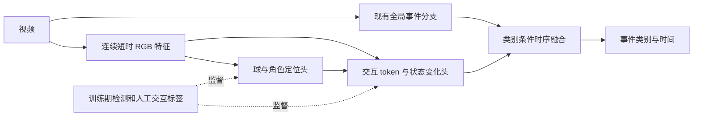

足球检测辅助路线复盘与交互监督实验方案

日期：2026-09-07。状态：基于代码、保存指标和报告的设计稿；未启动训练，未重新运行评测。文中的实验规模、超参数和收益门槛均为建议，不是已取得的结果。

**1. 决策**

球检测具备技术合理性，球门检测适合作为空间参照，但“检测更准”并不自动转化为“事件更准”。当前应把主假设从物体存在性转为：球—动作球员—门将之间的可观察交互和状态变化，能否在已有视频特征之外提供增量判别信息。

推荐实验为“交互状态监督 + 同场景困难负例 + 事件驱动的时序证据融合”。先做人工校正证据的诊断，再投入学生模型训练。不能诚实地承诺新结构必然正收益；可以提前定义机制、对照、验收和失败后走哪条路。

默认沿用现有工程意图：部署时无需 YOLO/RF-DETR。外部检测器仅用于训练数据生产和离线诊断。若未来允许部署检测器，可单独评估直接使用轨迹的成本与效果。

**2. 已核实的工程事实与解释边界**

| 事实 | 证据 | 能说明什么 |
|---|---|---|
| 早期对象热图实验仅训练辅助头 | `train_football_events.py:11086`；online allclips 日志记录 `trainable_params=3165711 temporal_head_params=0 lora_params=0` | 它验证的是冻结特征上的对象读出和残差融合，并未验证检测监督改善 DINO/事件 LoRA |
| 该实验与对应基线的保存 clip mAP 几乎相同 | 基线 0.57599233；object teacher 0.57578868；二者保存的 shot/save/set_piece 正样本数均为 705/343/369 | 未见有意义的排序增益；这里只是保存结果比较，尚非重新锁定协议后的配对实验 |
| 旧空间头已有路由，但其 relation 是 ball token、goal token、两者特征差及置信度统计 | `football_object_spatial_aux.py` | 特征相减不是物理相对位移，也没有明确接触、门将角色或动作结果监督 |
| 旧配置为 10 秒 16 帧，top-k ratio=0.03 | active object teacher 配置 | 720×1280、patch16 对应 3600 个 patch，top-k=108；局部小球信息存在稀释风险，是否实际发生需测注意力/定位 |
| 旧 provider 允许最近教师帧相差 0.65 秒，已运行但未检出的对象给零目标和有效 mask | `ObjectTeacherTargetProvider.targets` | 快速球可能发生时空错配；未检出是弱负监督而非完全 unknown。在线精确帧教师与 v7 的 0.10 秒匹配已有变化，不可把该问题套用于所有版本 |
| 当前 motion 分支已经有相对位置、速度、加速度、球附近人群池化、BallLoRA；v7 已加入离线跟踪和 cross-attention | `football_object_motion/model.py`；`scripts/run_object_motion_adapter_v7_offline_tracks.sh` | 继续提议“加运动/加 cross-attention”会重复已有路线 |
| v7 同时改变共享 anchor BallLoRA、stride8 热图、教师来源和融合路径 | v7 launcher | v4→v7 不是检测辅助任务的单变量对照。热图上采样不等于恢复 patch embedding 前已丢失的图像细节 |
| v4 epoch4 和 v7 epoch2 的保存 clip mAP 为 0.33484260 和 0.33382866；online selection 都不满足 recall floors | 对应 `metrics_epoch_*.json` | 尚无上线收益证据；它们的样本支持数与旧 57.6% 结果不同，不能据此声称辅助任务导致约 24pp 下降 |
| v4 训练平均 ball top1 hit≈0.666，goal≈0.940，clip residual abs≈0.00294；v7 ball≈0.446，clip residual abs≈0.05723 | 对应 JSON 的 `train_loss_components` | 都是训练伪标签诊断，不能当独立检测精度；教师改变后 top1 hit 也不可直接横比 |
| v7 关闭 presence loss、goal/person 新监督，保留旧 goal 读出 | v7 launcher | goal/presence 的零指标不可直接解释为“球门检测崩溃”；必须报告有效支持数、启用状态及阈值 |

保存指标来源：

- `outputs/football_events/vitl16_d7c_fullimage_latest_split_dino_pretrained_lora_ddp_720p_fromlast_e8_20260829/best_metrics.json`
- `outputs/football_events/vitl16_d7c_object_teacher_online_allclips_no_bad_media_from_fromlast_e8_20260901/best_metrics.json`
- `outputs/football_events/vitl16_d7c_object_motion_v4_causal33_720p_aux025_4gpu_from_object_e2_20260903/metrics_epoch_004.json`
- `outputs/football_events/vitl16_d7c_object_motion_v7_offline_balltrack_inheritedgoal_fpn8_crossattn_4gpu_from_v4e4_20260906_r5/metrics_epoch_002.json`

**3. 为什么检测可能没有收益**

任务相关性不足：射门和回传都能看到球，扑救和普通接球都能看到门将，定位球准备和普通禁区站位都能看到球门。检测提供“在哪里”，而这些类别的边界主要是“谁做了什么、前后发生了什么”。球门存在性的负例区分能力尤其有限。也不能要求射门必须朝图像中的门框运动：射偏、透视、空中球和球门出画都会破坏这个规则。

时序观测不足：当前 33 帧由三个 4 秒段各 11 帧组成，每段约 0.4 秒间隔，并非连续 25/30fps 动作观察。重复端点不增加观测信息。对触球、扑挡和轨迹突变，丢掉关键瞬间后，检测头和时序头都可能无法恢复信息。旧 16 帧/10 秒更稀疏。这里是可验证假设，不宣称所有事件都需要逐帧处理。

几何不稳定：现有 `camera_relative_velocity = ball_velocity - goal_velocity` 主要能抵消共同平移；球门误定位、缩放、旋转、目标切换仍可能形成假运动。person 热图的加权中心是人群中心，不是稳定身份的动作球员或门将。多球候选的加权中心也可能落在没有球的位置。

学习目标和梯度限制：冻结主干限制可学习信息；完全 detach 的对象证据则限制事件任务对读出特征的适配。反之，共享更新会有梯度干扰风险，但目前没有直接证据证明梯度冲突就是主要原因。PCGrad 只能在实测冲突后作为消融，不能替代改进任务目标。[Gradient Surgery](https://arxiv.org/abs/2001.06782)

数据与评测混淆：检测 coverage 不是 recall，更不是正确率。9 月 6 日汇总的 YOLO heatmap 可用 coverage 为 66.75%、motion 为 69.08%；这说明有可用数据，但不能证明关键事件瞬间的球轨迹可靠。9 月 7 日 test18 终审在修复后的 370 个扑救中补回 165 个，占 44.6%。此比例只适用于该 test18 审计，不能外推训练集；它提示旧标签上的 FP/FN 判断可能变化。

相关报告：`outputs/football_ball_detection_tracking_summary_20260906/report.md`；`outputs/football_event_review/test18_final_qc_report_20260907T0345Z/REPORT.md`。

**4. 新辅助任务的定义：可观察交互状态**

| 主任务 | 优先标注的中间证据 | 必须成对覆盖的难负例 |
|---|---|---|
| shot | 动作球员与球的接触/脱离时刻、踢击/头球动作、接触后的球运动变化 | 长传、传中、回传、解围；保留射偏/遮挡正例 |
| save | 门将响应动作、与球接触/近接触、随后持球/挡出/偏转；上下文中是否有进攻来球 | 接回传、捡球、无接触倒地、普通出击；保留不倒地的真实扑救 |
| set_piece | 静止或准备状态→执行动作→恢复运动的时序，必要时附带 subtype | 禁区站位、暂停等待、普通横传启动；覆盖快速任意球而非只学长时间静止 |

这些不是手工硬规则，也不是把 shot/save 标签换个名字再预测。中间标签应有自己的可观察定义和时间位置。球是否可见、是否存在可判别交互分别标注；不确定保持 unknown。shot 与 save 可共现，不能互作负类；没有预测到 shot 不得硬 veto save。

定位球仍按现有 accepted reviewed timestamp 评测。执行触球时刻作为独立辅助锚点，不能用它偷偷替换旧 GT 或窗口中点。raw subtype 仅从 accepted、定义一致的数据加入，罕见 penalty 不单独宣称收益。

最小新增数据建议：训练域约 1200 个短片段，三类各约 200 个正例和 200 个对应难负例，允许多标签重叠；按比赛和场地分层抽样，至少一半困难片段来自基线错误。另留约 300 个验证片段，源视频与训练严格隔离。该规模用于可行性试验，不保证统计功效。

每片段保留：reviewed event anchor、独立交互时间区间、可见性/不确定性、动作球员及门将的短轨迹或关键帧框、少量球中心/接触附近密集点、动作结果。只在接触附近约 ±1 秒优先密集校正，其他位置稀疏标注，避免全视频逐帧重标。随机抽取一部分由两人独立标注并裁决。训练外的证据诊断集与事件阈值校准集应区分职责。

普通训练负例只有在目标类别已完整审查时才作为强负例；基线高分但无旧 GT 的片段先审核。不能从 detector 漏检、raw 被拒绝记录或“没有 shot 标签”直接生成强负例。

**5. 先做证据诊断，回答“值不值得继续”**

从固定基线提取同一组候选、logits 和 RGB 特征。使用轻量、相近容量的融合头，按比赛分组训练/验证。所有组均使用同一批事件标签和采样。人工校正的轨迹只用于诊断实验，不进入最终部署评测。

| 组 | 输入/监督变化 | 要回答的问题 |
|---|---|---|
| O0 | 基线特征 + 小融合头 | 单纯增加参数或重校准是否有收益 |
| O1 | O0 + 当前自动球/门/人证据 | 现成检测是否有增量价值 |
| O2 | O0 + 人工校正的对象位置和短轨迹 | 在这个读出器下，改善检测质量是否有潜力 |
| O3 | O2 + 可观察交互状态/角色 | 是否必须引入语义交互，位置本身不够 |

O2/O3 是特定模型和标注下的乐观证据诊断，不是理论上界。中间状态不可直接包含事件类别文本；O3 本身也不能当部署收益。对同场地、相近可见性和运动强度的难负例分层比较，避免只识别视频来源。

决策：O2优于O1，优先解决检测/轨迹质量；O3优于O2，进入交互监督；O1—O3均无明显增益，先检查样本规模和读出能力，若两种合理轻量读出仍无增益则停止该辅助方向，优先完整标注和高时间分辨率 RGB 事件学习。不能据单个失败 probe 证明信息绝对无用。

再做保持单帧边际分布的时间打乱、同视频匹配轨迹替换、遮蔽球证据等依赖性诊断。真实轨迹模型优于这些对照支持“利用时序证据”，不构成严格因果证明；随机打乱本身也可能制造分布外输入。

**6. 通过诊断后的学生模型**

局部动作支路先试 4 秒约 32 帧（约 8fps），保持完整长窗语义；这是采样起点，关键接触定位不足再比较 16fps。长视频按绝对时间轴缓存唯一帧并滑动覆盖，不仅在 GT 中心运行，也不要求 detector 有输出才触发。proposal 模式必须另报候选召回上限和端到端漏检；首轮增益实验固定候选，避免候选集变化冒充分类提升。

先使用已有视频特征实现交互监督；相同采样/分辨率的 RGB-only 支路作为硬对照。只有人工定位改善而现有 patch 无法恢复细节时，才增加原图局部重编码或更细图像 stem，并另设同分辨率无检测监督对照。旧项目已有 VideoMAE/ROI 分支，复用经过核查的模块，不以更换 backbone 当成创新或收益保证。

每时刻保留若干对象候选和 null token，而不是全图强制 argmax。动作球员、门将角色用少量人工标签训练角色 query，teacher 人框提供候选但不把“离球门最近的人”强制当门将。门框/场线稳定时用作相对坐标参照；相机运动可由可靠背景匹配估计，必须记录拟合质量，失败则关闭几何损失并保留 RGB 路径。图像距离不宣称真实米制距离，空中球不强行套用平面单应。

训练采用三态对象监督：可确认目标为 positive，人审无目标为 trusted negative，其余 unknown。置信度用于样本权重，不再乘低 heatmap 峰值目标；保留多候选/插值来源与不确定性。轨迹一致性只在可信关联和时间间隔内计算，不跨长遮挡强行平滑；接触附近速度突变可能是事件信号，不惩罚真实突变。

事件路径消费连续交互特征，并可输出可解释状态；不把离散辅助预测当不可绕过的瓶颈。检测框坐标/离散关联可 detach，事件 loss 能更新交互读出及独立事件 adapter。第一阶段冻结原 anchor，验证新分支；第二阶段如有收益，再单独比较小范围联合微调。冻结 anchor 只保证原输出可恢复，不保证融合后性能不降。

损失写为：

`L = L_event + λ_phase L_phase + λ_contact L_contact + λ_rank L_hard_pair + λ_obj L_object + λ_consistency L_track`

主损失始终是事件类别/时间监督。辅助权重先按梯度范数校准，小规模验证选择；不同时搜索大量 loss。L_hard_pair 只比较同类别可信正例与已审查难负例，保持其他类别的多标签掩码，不要求可见正例压过遮挡正例。监督状态随真实动作标注，禁止从固定 ±秒区间直接编造“接触/扑救后持球”标签。

如果慢、高帧率 teacher 的事件与交互指标先有收益，再蒸馏至无检测器 student。teacher 只生成对象标签但自己的事件判别并未改善，不足以支持进一步大规模蒸馏。

**7. 最小正式消融与停止条件**

| 组 | 条件 |
|---|---|
| B0 | 同一 checkpoint、标签、完整视频协议下重新评测当前基线 |
| B1 | 相同短时帧预算/新融合头，仅 RGB 事件监督 |
| B2 | B1 + 对象检测监督 |
| B3 | B1 + 交互/状态监督，不加对象 loss |
| B4 | B1 + 对象检测 + 交互/状态监督 |

B1—B4 使用相同的新标注片段、困难负例与事件训练预算。先固定随机种子 pilot，胜出组与 B1/B0 再做至少 3 个种子；辅助权重仅在验证集决定。若 B3≈B4 且都优于 B1，则保留交互监督，删除没有贡献的检测 loss。若只有 B1 提升，则收益来自时间采样/视觉分支，不能记到检测辅助上。

球-only、goal-only、真实/打乱轨迹可作为胜出配置的后续诊断，不一开始铺开全部组合。

评测先冻结 video IDs、annotation hash、checkpoint hash、采样规则、score 语义、阈值来源、类别映射、时间容差和 NMS；修复后 test18 需要基线与新模型成对重评。它已被多轮查看，不应称为从未接触的最终盲测；新实验选择使用训练/验证，必要时再留全新比赛作为确认集。158 个 YOLO 视频包含训练/验证，不能整包直接用作训练；test18 RF-DETR 数据只做隔离评测。

主指标采用完整长视频上的类别事件 Precision，在验证集拟合 threshold 满足 shot Recall≥90%、save/set_piece≥85%，同时报告共同 R80/R85/R90 曲线作诊断；测试只用冻结阈值，若达不到召回约束，应如实报告不可行，不在测试重新降阈。尚未完成人审的区域不作确定负例，另报已完整审查的时长与事件支持数。

建议通过门槛：在满足各类召回约束且单类召回下降不超过 1pp 的前提下，相比 B0 和 B1，目标类别 P 提高至少 3 个百分点，或 FP/90min 减少至少 15%；同时检查其他类别没有实质退化、跨类合并的人工观看时长减少。幅度是预先约定的业务门槛，不是效果预测。按比赛/视频做配对 bootstrap，报告 95% CI；先观察验证方差再确定是否需要更多比赛，不能把相邻窗口当独立样本计算显著性。

辅助评测：人工球定位召回@固定 FP/frame、中心误差分位数、关键事件前后 coverage、角色准确率、接触时刻误差、交互状态 macro-F1，以及事件可见/遮挡、相机运动、场地和难负例分桶结果。训练 teacher-hit 不替代这些指标。

资源报告：新增解码帧、teacher 离线生产时间、部署延迟/吞吐、峰值显存、缓存大小。所有正式实验从一致可恢复的 anchor 开始，不沿失败分支持续串行继承后把变化归因于某个 loss。

**8. 实施落点与建议次序**

第一步优先实现协议与证据 probe：复用 `football_eval_semantics.py`、完整视频评测和已有离线索引。产出统一 baseline 指标、人工校正小集与 O0—O3 对照，不立即改大训练入口。

第二步通过后新增独立交互标注 schema/provider、角色与交互头、masked loss；复用 `football_object_motion/offline_teacher.py` 的绝对时间/来源接口，并保留现有配置以便复现。新增模块建议隔离在 `football_interaction_aux/`，在主模型以可关闭分支接入。

第三步跑 B1—B4；优胜配置才考虑学生蒸馏、联合 LoRA 或更高分辨率。正式训练前只做必要的坐标增强对齐、unknown mask、多标签兼容、梯度实际更新与关闭分支恢复基线的检查。

公开研究支持足够的时间上下文和细微帧间动作差异的重要性，但不能保证本项目提升：[E2E-Spot，ECCV 2022](https://arxiv.org/abs/2207.10213)。SoccerNet 官方 ball-action 数据也区分传球、传中、射门、拦截等细动作，可参考其标签边界，但广播视频结论必须在当前运动相机域重新验证：[官方代码与任务说明](https://github.com/SoccerNet/sn-spotting)。
